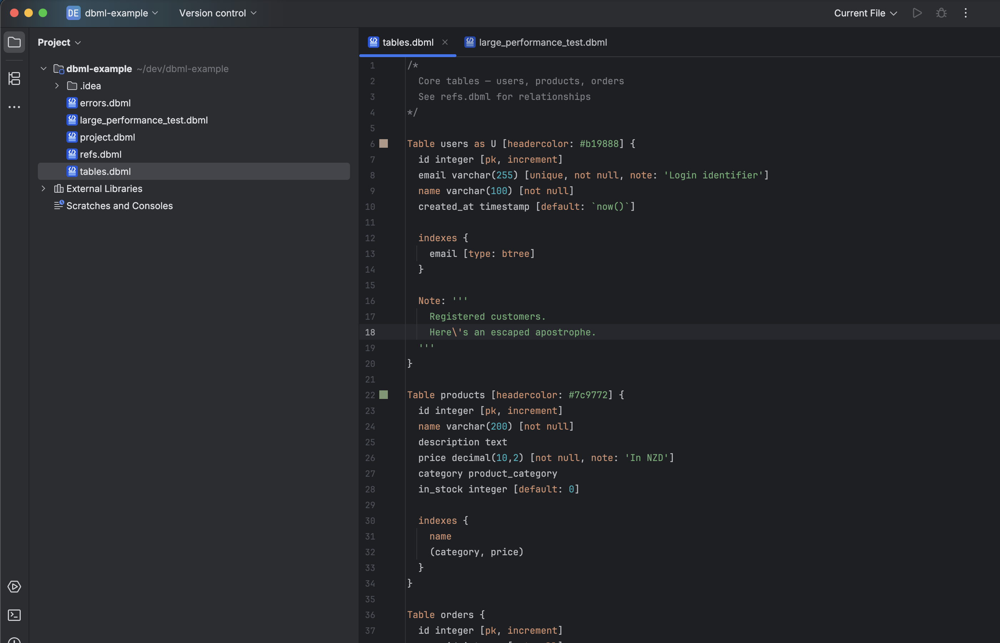
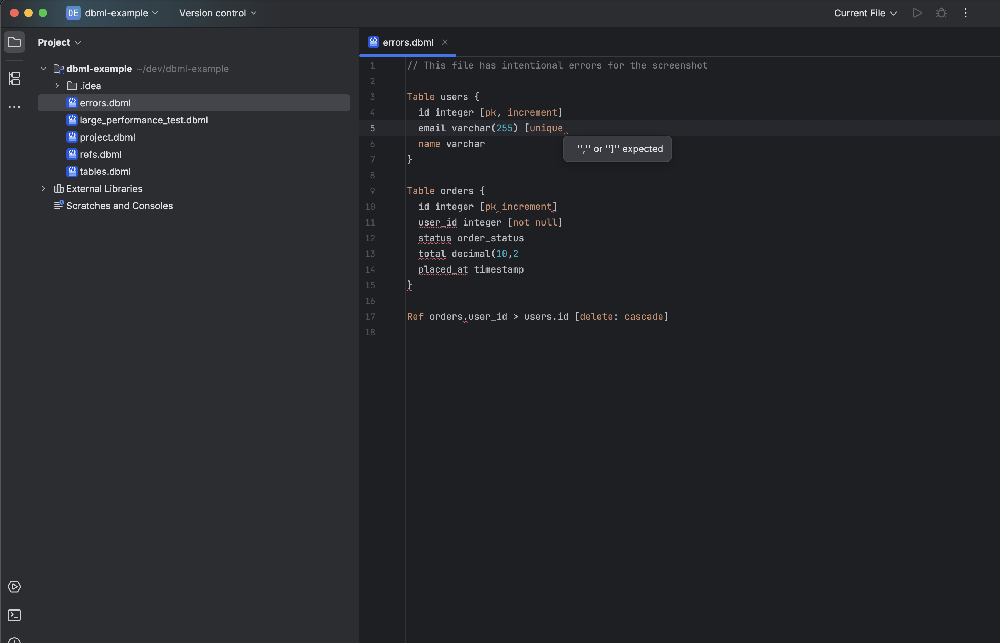

# DBML

<!-- Plugin description -->
[DBML](https://dbml.dbdiagram.io/) language support for JetBrains IDEs.

- Syntax highlighting for keywords, strings, numbers, comments, operators, and expressions
- Escape sequence highlighting in multi-line strings
- Colour preview and picker for `headercolor` / `color` hex codes
- Human-friendly error highlighting for malformed `.dbml` files
- Configurable colour scheme (Settings | Editor | Color Scheme | DBML)
- Brace matching for `{}`, `[]`, `()`
- Line and block comment toggling
<!-- Plugin description end -->

## Screenshots

### Syntax Highlighting and Colour Preview

### Error Highlighting

## Installation

- <kbd>Settings</kbd> > <kbd>Plugins</kbd> > <kbd>Marketplace</kbd> > search for **"DBML"** > <kbd>Install</kbd>

- Or download from [JetBrains Marketplace](https://plugins.jetbrains.com/plugin/MARKETPLACE_ID) and install via
  <kbd>Settings</kbd> > <kbd>Plugins</kbd> > <kbd>Install plugin from disk...</kbd>

## Supported Constructs

Tables, columns, enums, refs, indexes, table groups, table partials, named notes, and project definitions — the full [DBML specification](https://dbml.dbdiagram.io/docs/).

## Known Limitations

- In very large files, clicking a colour swatch immediately after editing may show an error. This is a platform limitation — wait a moment for the highlighting pass to complete and the swatch will work again.

## Links

- [Source code](https://github.com/LiamClarkeNZ/dbml-plugin)
- [Issue tracker](https://github.com/LiamClarkeNZ/dbml-plugin/issues)
- [DBML documentation](https://dbml.dbdiagram.io/docs/)

## Licence

Source code: [MIT](LICENSE)

The DBML logo is used with permission from the [DBML maintainers](https://github.com/holistics/dbml/discussions/845) under the terms of the [Apache 2.0 licence](https://github.com/holistics/dbml/blob/master/LICENSE).
